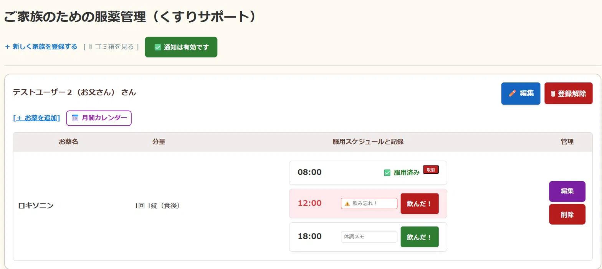
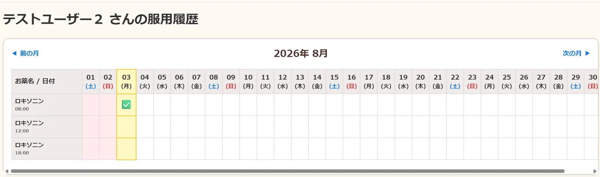
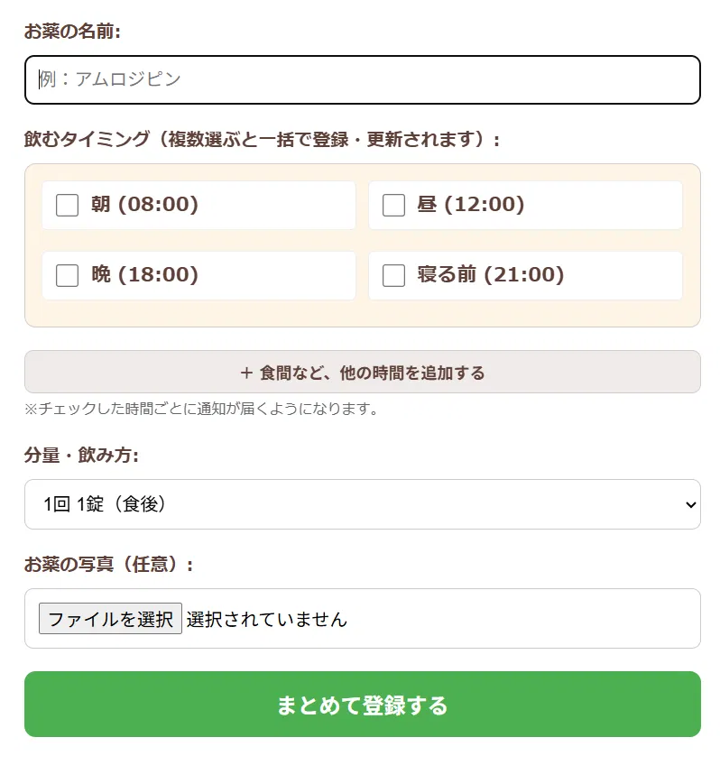
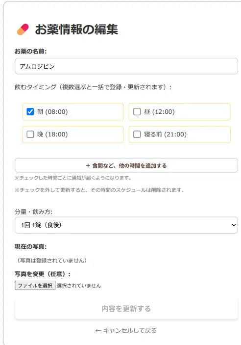
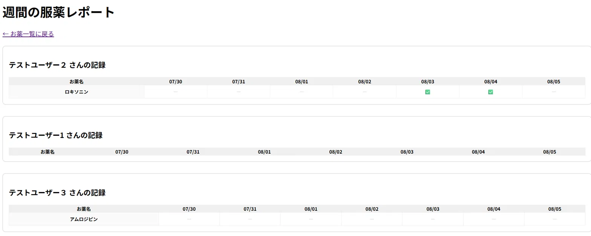

# くすりサポート (Medication Reminder App)

高齢のご家族など、複数人分のお薬管理と服薬記録を行うためのWebアプリケーションです。
元看護師としての臨床経験をもとに、「飲み忘れを防ぎたい」「誰が・いつ・どの薬を飲んだかを記録したい」というニーズから開発しました。

## 主な機能

- **患者（ご家族）管理**：複数の患者を登録し、それぞれの服薬情報を個別に管理
- **お薬管理**：薬名・分量・服用時刻を登録し、写真も添付可能
- **服薬記録**：「飲んだ」「取り消し」の記録をワンタップで保存
- **プッシュ通知によるリマインダー**：服用時刻にブラウザ通知でお知らせ（Web Push）
- **ゴミ箱機能**：誤って削除したデータを復元できる論理削除（Soft Delete）
- **認証機能**：Laravel Breezeによるログイン・会員登録・パスワードリセット

## 技術構成

| カテゴリ | 使用技術 |
|---|---|
| バックエンド | PHP 8.1 / Laravel 10 |
| データベース | MySQL 8.0 |
| フロントエンド | Blade / Tailwind CSS / Alpine.js |
| 認証 | Laravel Breeze |
| プッシュ通知 | laravel-notification-channels/webpush |
| 開発環境 | Docker / Docker Compose |
| メール確認（開発用） | Mailpit |
| コード整形 | Laravel Pint |
| テスト | PHPUnit |

## データベース構成

| テーブル | 役割 |
|---|---|
| `users` | ログインするユーザー（ご家族の代表者など） |
| `patients` | 服薬管理の対象となる患者（ユーザーに紐づく） |
| `medicines` | 患者ごとに登録するお薬情報（薬名・分量・服用時刻） |
| `adherences` | 服薬記録（いつ・どの薬を飲んだか） |

**リレーション**：`User` 1 - N `Patient` 1 - N `Medicine` 1 - N `Adherence`

## セットアップ手順（Docker）

### 前提

- Docker Desktop がインストール済みであること

### 手順

```bash
# 1. リポジトリをクローン
git clone https://github.com/asuka0120/medication-reminder-app.git
cd medication-reminder-app

# 2. 環境変数ファイルを作成
cp laravel_app/.env.example laravel_app/.env

# 3. コンテナを起動
docker compose up -d

# 4. 依存パッケージをインストール
docker compose exec web composer install

# 5. アプリケーションキーを生成
docker compose exec web php artisan key:generate

# 6. マイグレーションを実行（テーブル作成）
docker compose exec web php artisan migrate
```

起動後、以下のURLにアクセスできます。

- アプリ本体: http://localhost
- Mailpit（開発用メール確認画面）: http://localhost:8025

## 環境変数の設定

`.env.example` をコピーした `.env` は、この開発環境（Docker Compose）の設定に合わせてあるため、基本的にはそのままで動作します。編集する場合や、値の意味を知りたい場合は以下を参考にしてください。

| 変数名 | 役割 | 備考 |
|---|---|---|
| `APP_URL` | アプリのURL | ローカル開発では `http://localhost` のままでOK |
| `APP_KEY` | 暗号化キー | `php artisan key:generate` で自動生成されるため、手動で入力する必要はない |
| `DB_CONNECTION` / `DB_HOST` / `DB_DATABASE` / `DB_USERNAME` / `DB_PASSWORD` | データベース接続情報 | `docker-compose.yml` のMySQLコンテナの設定と合わせてある |
| `MAIL_MAILER` / `MAIL_HOST` / `MAIL_PORT` | メール送信設定 | 開発環境ではMailpitに向けているため、実際のメールサーバーは不要（送信したメールは http://localhost:8025 で確認できる） |
| `VAPID_PUBLIC_KEY` / `VAPID_PRIVATE_KEY` | プッシュ通知（Web Push）用の鍵ペア | `.env.example` には含まれていない。サーバー側からのプッシュ通知（`app/Notifications/MedicationReminder.php`）を有効にする場合のみ、下記コマンドで生成する |

プッシュ通知用の鍵を生成する場合：

```bash
docker compose exec web php artisan webpush:vapid
```

実行すると、`VAPID_PUBLIC_KEY` と `VAPID_PRIVATE_KEY` が自動的に `.env` に追記されます。

## データベース（マイグレーション）

初回セットアップ時は前述のとおり `php artisan migrate` を実行します。それ以外に、以下のようなケースで使うコマンドです。

```bash
# 開発中にテーブル構成を最初からやり直したい場合
# （既存のデータは全て削除されるので注意）
docker compose exec web php artisan migrate:fresh

# 未実行のマイグレーションがどれか確認したい場合
docker compose exec web php artisan migrate:status
```

主なテーブルは前述の「データベース構成」の通りです。マイグレーションファイルは `laravel_app/database/migrations/` にあり、ファイル名の日付順に実行されます。

## テスト

```bash
# 自動テスト（PHPUnit）を実行
docker compose exec web php artisan test
```

`laravel_app/tests/Feature/` 以下に、認証まわり・患者情報のCRUD・お薬の登録更新・服薬記録の重複防止・認可（他人のデータにアクセスできないか）などの機能テストがあります。コミット前には、コードスタイルの確認とあわせて以下を実行しています。

```bash
# コードスタイルチェック・自動整形（Laravel Pint）
docker compose exec web php vendor/bin/pint

# 自動テスト
docker compose exec web php artisan test
```

開発初期段階では、上記に加えてExcelベースの手動テストケース（認証まわり42件など）による検証も行っています。

## スクリーンショット

### お薬一覧・服薬記録画面

患者ごとのお薬と、当日の服薬状況を一覧表示。「飲んだ！」ボタンでワンタップ記録でき、飲み忘れている時間帯は赤く警告表示されます。



### 月間カレンダー画面

1ヶ月分の服薬記録をカレンダー形式で確認できます。



### お薬登録・編集画面

薬名・分量・服用時刻・写真を登録します（新規登録画面・編集画面）。




### 週間服薬レポート画面

登録している患者さん全員の服薬記録を、直近1週間分まとめて確認できます。



## コードスタイル

[Laravel Pint](https://laravel.com/docs/pint) によるコード整形ルールに従っています。コミット前に以下を実行してください。

```bash
docker compose exec web php vendor/bin/pint
```

## ディレクトリ構成（抜粋）
```
laravel_app/
├── app/
│   ├── Http/Controllers/   # 患者・お薬・ゴミ箱などの各種コントローラー
│   ├── Models/             # User, Patient, Medicine, Adherence
│   └── Notifications/      # 服薬リマインダー通知
├── database/migrations/    # テーブル定義
├── resources/views/        # Bladeテンプレート
├── routes/web.php          # ルーティング定義
└── tests/                  # PHPUnitテスト
```
## ライセンス

このプロジェクトは学習・ポートフォリオ目的で作成されています。